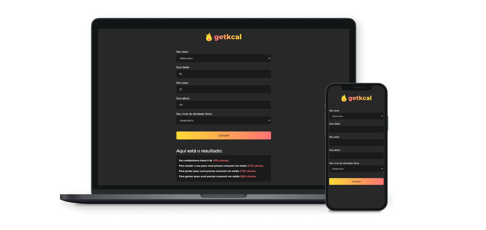

# getKcal 

<p align="center">
  
</p>
<p align="center">
  <a href="#o-projeto">Projeto</a>&nbsp;&nbsp;&nbsp;|&nbsp;&nbsp;&nbsp;
  <a href="#tecnologias">Tecnologias</a>&nbsp;&nbsp;&nbsp;|&nbsp;&nbsp;&nbsp;
  <a href="#Behavior">Behavior</a>&nbsp;&nbsp;&nbsp;|&nbsp;&nbsp;&nbsp;
  <a href="#executando-o-projeto">Executar</a>
</p>

## O Projeto
getKcal é uma aplicação web desenvolvida com o objetivo de calcular o metabolismo basal, o consumo médio de calorias para perder, ganhar ou manter peso. As fórmulas matemáticas usadas no cálculo foram obtidas através de pesquisas. Foi desenvolvida durante uma vídeo-aula do canal [Mateus Silva](https://www.youtube.com/c/MateusSilvaDev)

## Tecnologias

Esse projeto foi desenvolvido com as seguintes tecnologias:

- HTML
- CSS
- JavaScript

## Behavior


## Executando o projeto

```bash
# Clone este repositório
$ git clone https://github.com/LeandroFilie/getKcal.git

# Acesse a pasta do projeto no seu terminal/cmd
$ cd getKcal
```

---

Feito com :heart: by [Leandro Filié](https://github.com/LeandroFilie)
